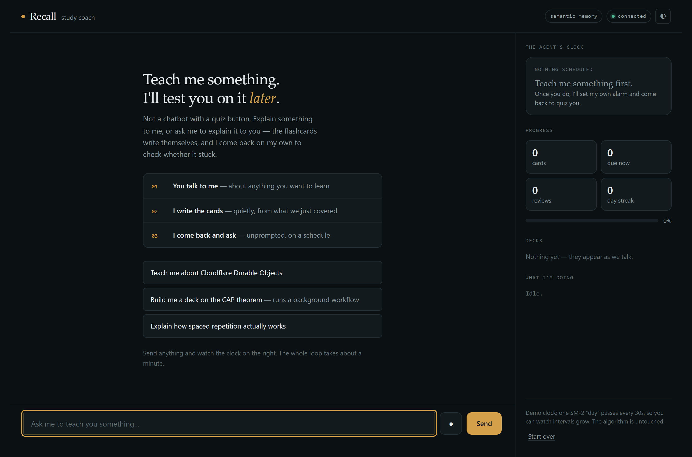
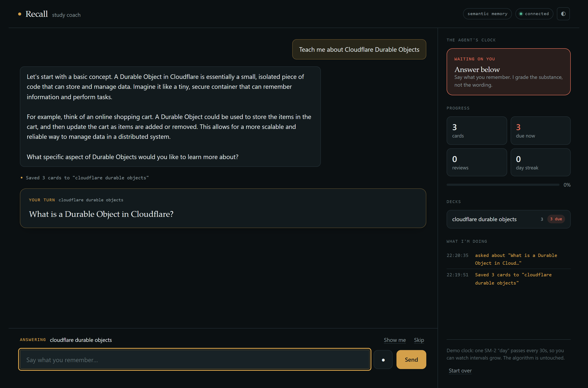
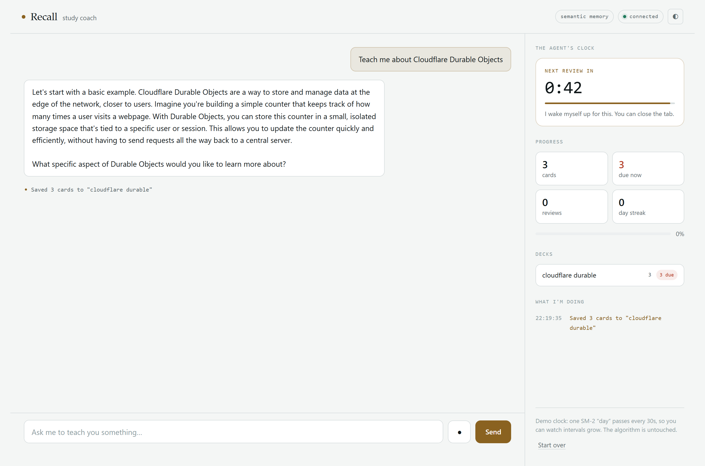

# Recall

**Live: https://recall-agent.rogerdemello.workers.dev**

A spaced-repetition study coach that teaches you something, quietly turns it into
flashcards, and then **wakes itself up later to test you on them**.

Built on the [Cloudflare Agents SDK](https://agents.cloudflare.com/). Every learner gets
their own Durable Object, which holds their conversation, their cards, their review
schedule, and their streak — and which can run on its own clock whether or not anyone
has the page open.



The panel on the right is the point. **The agent's clock counts down to the moment
it will wake itself up and quiz you** — the one genuinely surprising thing this
does, and the one you'd otherwise miss by closing the tab too early.

Forty-five seconds after the lesson, with nobody typing:



Nothing in the browser polled for that. A Durable Object alarm fired, the agent
picked its most overdue card and pushed it down the socket. It would have fired
with the tab closed.

---

## What it demonstrates

| Assignment requirement | How it's met |
| --- | --- |
| **LLM** | Llama 3.3 70B on Workers AI (`@cf/meta/llama-3.3-70b-instruct-fp8-fast`) for chat, grading, outlining and card writing — via `workers-ai-provider` + the Vercel AI SDK, routed through **AI Gateway** when one is configured. No API keys. |
| **Workflow / coordination** | A real **Cloudflare Workflow** (`DeckBuilder`) for durable multi-step deck generation, plus `this.schedule()` for self-triggered reviews and the AI SDK tool loop for in-turn coordination. |
| **User input via chat or voice** | A static HTML chat UI over WebSocket, **and** push-to-talk using `@cf/openai/whisper-large-v3-turbo`. |
| **Memory / state** | Three layers: SQLite inside the Durable Object (source of truth), **Vectorize** for semantic recall and near-duplicate detection, and a rolling LLM-generated summary that lets a 24k-token model hold a much longer conversation. |

## Quickstart

```bash
npm install
npx wrangler login                                            # Workers AI needs an account
npx wrangler vectorize create recall-memory \
  --dimensions=768 --metric=cosine                            # semantic memory
npm run dev
```

Open the printed URL. That's it — there are no API keys and no `.env` file.

**Without a Vectorize index?** Set `"MEMORY_MODE": "sql"` in `wrangler.jsonc` and skip the
`vectorize create` step. Recall degrades to keyword search and literal deduplication;
everything else works unchanged.

```bash
npm test          # 75 unit tests — SM-2, grade parsing, LLM output parsing, stream repair
npm run typecheck # both tsconfigs: worker and browser
npm run deploy    # build + deploy
```

### Verifying it for yourself

Unit tests only cover the pure logic. The agent loop is checked by two harnesses that
drive it over a real WebSocket, exactly as the browser does, and assert on what comes
back — including waiting for the scheduled quiz to arrive with no request behind it.

```bash
npm run verify -- 5173                                   # against wrangler dev
npm run verify -- recall-agent.rogerdemello.workers.dev  # against production
npm run verify:workflow -- 5173                          # the DeckBuilder Workflow
```

Last run against the live deployment: **18/18** and **5/5**.

```
PASS  Cards mined from the conversation unprompted — Saved 3 cards to "cloudflare durable"
PASS  Agent pushed a quiz unprompted — "What is a Durable Object in Cloudflare?"
PASS  Pass flag agrees with the SM-2 threshold — grade=4, passed=true
PASS  Model used search_memory — 1 call(s)
PASS  Transcript replayed on reconnect — 8 messages
...
PASS  Workflow completed — Added 19 cards (1 duplicates skipped)
```

The harnesses take a few minutes: they wait out the real review schedule rather than
mocking the clock.

## Seeing it work

Full walkthrough in [`docs/DEMO.md`](docs/DEMO.md). The short version:

1. **"Teach me about Cloudflare Durable Objects."** Watch the reply stream in, and watch
   a `saving 4 cards` chip appear that you never asked for. The card count in the sidebar
   ticks up.
2. **Stop typing and wait ~45 seconds.** The agent pushes a question at you unprompted.
   Nothing in the browser polled for it — a Durable Object alarm fired.
3. **Answer it badly on purpose.** You get graded, shown the real answer, and the card
   comes back soon. Answer the next one well and the interval stretches out.
4. **"Build me a deck on the CAP theorem."** A Workflow starts; the sidebar shows real
   step-by-step progress as each subtopic is generated and persisted.
5. **Reload the page.** Conversation, cards, streak and schedule are all still there.

> **On the clock.** SM-2 works in days, which makes for a poor demo. `SECONDS_PER_DAY`
> in `wrangler.jsonc` compresses one "day" to 30 seconds so intervals are observable in
> real time. The algorithm is untouched — only the unit is scaled. Set it to `86400` for
> real behaviour.

## How it fits together

```
Browser — static HTML, vanilla TS, no framework
  │  WebSocket ....... chat, token stream, synced state, unprompted quiz pushes
  │  POST /api/transcribe ... audio blob → Whisper
  ▼
Worker (routeAgentRequest)
  ▼
StudyCoach — one Durable Object per learner
  ├─ this.sql ........ cards · reviews · transcript · profile
  ├─ this.setState ... counts, mastery, streak, active review, workflow progress
  ├─ this.schedule ... wakes the agent up to quiz you
  ├─ tools ........... add_cards · search_memory · build_deck · quiz_me · get_progress
  └─ runWorkflow ──▶ DeckBuilder — durable, retried per step, RPCs cards back
Workers AI ... Llama 3.3 · bge-base-en-v1.5 · whisper-large-v3-turbo
Vectorize .... 768-dim cosine index, namespaced per learner
```

Detail in [`docs/ARCHITECTURE.md`](docs/ARCHITECTURE.md); the agent's own design — system
prompt, tool contracts, memory model, the SM-2 maths — in [`docs/AGENT.md`](docs/AGENT.md).

## Three decisions worth reading

All argued properly in [`docs/DECISIONS.md`](docs/DECISIONS.md).

**Workers AI over an external LLM.** The brief allowed any LLM, and NVIDIA NIM was
considered. Workers AI won on three counts: it needs no API key, so this repo is
clone-and-run; it is the only option that is a *binding* rather than an HTTP call with
egress latency; and NIM is not an AI Gateway provider, so routing it through the gateway
for caching and logs was not possible. `src/server/model.ts` is the single swap point if
that judgement should ever change.

**Nothing load-bearing is a tool call.** A tool call is a *probabilistic* branch, so the
two things the product cannot work without — grading a review and mining cards out of the
conversation — are routed in code instead. Card mining started life as an `add_cards`
tool; testing against live Workers AI showed Llama 3.3 emits prose *or* a tool call in a
step and almost never both, so "explain the concept, then silently save cards" never
fired. It is now a separate extraction pass and works every time.

**A turn is two model calls, because of a provider bug.**
`workers-ai-provider@4.0.0` double-emits every stream delta. That garbles prose, and worse,
it corrupts tool-call arguments into unparseable JSON so tools never execute. Prose is
repaired by middleware; tool arguments cannot be, because the provider assembles them
internally before anything reaches the stream. So tools run through `generateText` (where
they work) and the visible reply streams through `streamText` (where it's clean). Full
reproduction in [`src/server/stream-dedupe.ts`](src/server/stream-dedupe.ts).

## The interface

Dark by default, light when your OS asks for it, with a toggle either way.



A few deliberate choices:

- **The countdown is the hero.** Everything else in the panel is a number; that
  one creates anticipation. A visitor who can see "next review in 0:38" waits for
  it. A visitor who can't, leaves.
- **The agent narrates itself.** Searching memory, mining cards, each workflow
  step — all of it surfaces in an activity log, so the machinery is legible
  instead of implied.
- **Decks are browsable.** Click one and the actual cards slide out, each tagged
  by stage (unseen / learning / learned / due) so SM-2's effect is visible rather
  than described.
- **The compressed clock is stated, not hidden.** The panel says outright that a
  demo "day" is 30 seconds, because showing a "6 day" interval that elapses in
  three minutes without explanation would be a small lie.
- **Zero external requests.** No webfonts, no CDNs — a bookish `ui-serif` display
  paired with the system sans, and `ui-monospace` with tabular figures for data.

## Layout

```
src/server/
  index.ts           Worker entry — routing + /api/transcribe
  agent.ts           StudyCoach: the agent loop, review loop, card mining
  deck-workflow.ts   DeckBuilder: durable multi-step deck generation
  tools.ts           the four tools the model can call
  memory.ts          Vectorize + rolling summary + context assembly
  schema.ts          SQLite schema and every query
  sm2.ts             spaced repetition — pure, no I/O
  grading.ts         parsing a grade out of model prose
  parsing.ts         parsing subtopics, decks and cards out of model prose
  stream-dedupe.ts   middleware repairing the provider's double-emitted deltas
  model.ts           the one place the LLM is chosen
src/client/          index.html + app.ts + voice.ts + styles.css
src/shared/          the wire protocol, compiled into both sides
test/                75 tests over the pure logic
```

`sm2.ts`, `grading.ts`, `parsing.ts` and `stream-dedupe.ts` are pure and separately
tested. That is deliberate: they hold the logic where a silent bug would corrupt a
learner's schedule, quietly drop generated cards, or ship doubled prose — and none of it
needs a Worker runtime to verify.

## Prompt history

The assignment asks for it: [`PROMPTS.md`](PROMPTS.md).

## Licence

MIT.
